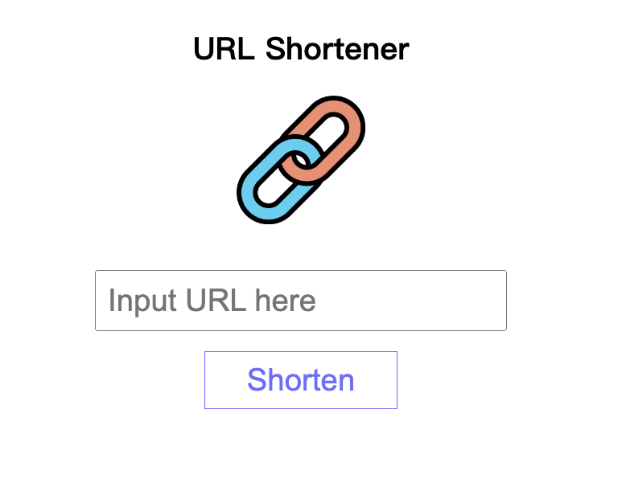

# 短網址產生器


## 介紹
將輸入的網址轉換成較短的網址名稱

### 功能
- 將輸入的網址轉換成「主機名稱＋5個英文字符或數字」的短網址
- 短網址連接到原本輸入的網址
- 將新網址複製到使用者的剪貼簿(Copy按鈕)

### 開始使用
1. 需有安裝 Node.js 以及 npm
2. 將此專案 clone 至本地
3. 從終端機進入此專案資料夾，輸入以下指令安裝套件
```
npm install
```
4. 安裝完畢後，輸入以下指令啟動專案
```
npm run start
```
5. 若終端機顯示 "The Express server is listening on localhost:3000" 則代表專案運行正常，請打開瀏覽器輸入以下網址
```
http://localhost:3000
```
6. 若需種子資料，可執行以下指令
```
npm run seed
```
7. 終止專案請於終端機輸入
```
ctrl + c
```

# 開發工具
- Node.js 18.16.0
- Express 4.18.2
- Express-Handlebars 4.0.2